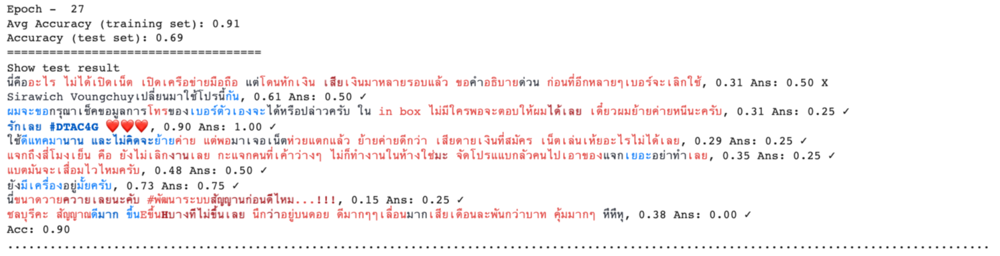
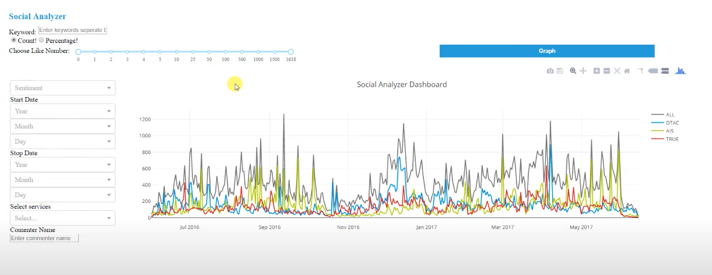

### DtacInternship: Thai Social Media Sentiment Analysis with Recurrent Neural Network

At my internship at Dtac, my task was to gain insights into how well Dtac has been doing against its two main competitors from Facebook comments. The approach was to build a semi-supervised sentiment analysis model. Ten percent of all collected data was tagged thanks to the call-center team at Dtac. Then, a sentiment analysis model was built on those trained data and labeled the rest of the data.

Slide: [[Link](https://docs.google.com/presentation/d/1ZNMj2tgbtvxY6H8wocnGpkax7qt4JmFJD9PUrnJl9rs/edit?usp=sharing)]

The project started from scratch, and can be categorized into:

1. Facebook comments data crawler: [[Link](https://github.com/teerapat-ch/FacebookCommentMining)]
2. Labelling platform: [[Link](https://github.com/teerapat-ch/SentimentScorerBackend)]
3. Sentiment Analysis with LSTM: [[Link](https://github.com/teerapat-ch/DtacInternship/blob/master/Regression%20LSTM%20on%20comments.ipynb)]
4. Visualization Dashboard (sample below)
5. Project report: [[Link](result/Thai%20Social%20Media%20Sentiment%20Analysis%20draft.pdf)]

---

### Result

#### Sentiment Analysis Model

While the comments were tagged on comment level, we were able to provide predictions at a word-level by taking the output of the LSTM at each word. The model seemed to work quite well even for comments with multiple phrases or sentences with different sentiments. One trick to ensure this was to only include short comments in the training/labelling data, which then forced the model to learn only from comments that have one sentiment.

<!-- ##### Sample output (roughly translated) -->   
<!-- From Chonburi here. The signal is very good. Sometimes the signal got E or H. Felt that I was on the mountain, very good! I pay more than a thousand baht per month. Very worthwhile. Haha. -->

#### Findings

We used the obtained sentiment analysis to label the whole Facebook comments we have, and plot them as a graph to compare how Dtac had been performing against its competitors. 

Interestingly, we noticed a surge of negative comments on Dtac on particular date. Upon further investigation, it seemed that there was a huge network maintenance that caused the whole area network to shuwdown. This showed how our project was able to reflect the real-world phenomenon through digital data.
